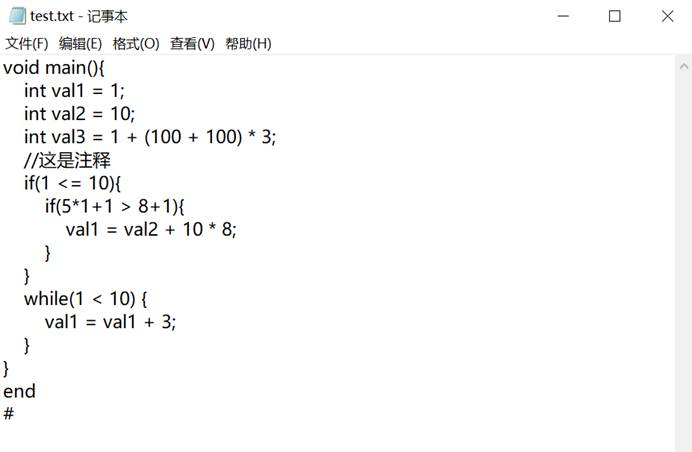
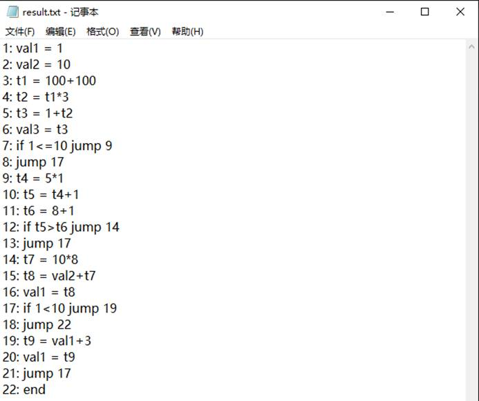

## Mini Front-end Complier

### 目标

设计并实现一个一遍扫描的编译前端，将简化高级语言的部分语法成分（含赋值语句、分支语句、循环语句等）翻译成四元式，能通过语法分析检测出程序错误并给出错误提示。

### 使用

       1. 将需要进行语义分析的源程序写入test.txt文本文件中。
    2. 运行Compiler.exe可执行文件。
    3. 在result.txt中查看分析结果。

### 程序说明

#### **语法制导翻译方法**

递归下降语法制导翻译，是通过向一个文法的产生式附加一些规则或程序片段而得到的语义分析过程。

主函数调用lrparser函数，在原来语法分析的基础上添加相应的语义动作，将输入串翻译为四元式序列并保存，其中如有语法错误则输出错误信息：错误类型和行数，没有错误就调用printProc()将四元式以三地址代码与指令形式输出。可以翻译赋值语句，循环语句，条件语句。

yucu函数对语句串进行分析识别，为分号相连（赋值语句之间）或大括号相连（条件，循环语句之间）的语句。

函数statement对语句类型进行分辨，调用对应的的语句分析函数，形成对应的四元式并保存。

#### 语法成分

程序，语句块，语句串，语句，赋值语句，循环语句，条件语句，表达式，项，影子，条件，ID， NUM。

#### 文法

+ <程序> →void main()<语句串>end
+ <语句块>→{<语句串>}
+ <语句串> → <语句> (;语句)*
+ <语句> → <赋值语句>|<循环语句>|<条件语句>
+ <赋值语句> → ID= <表达式>
+ <表达式> → <项> (+<项>|-<项>)*
+ <项> → <因子> (\*<因子>|/<因子>)*
+ <因子> → ID | NUM | (<表达式>)
+ <循环语句> → while(<条件>)<语句块>  
+ <条件> → <表达式> >|<|==|>=|<=|!= <表达式>
+ <条件语句> → if (<布尔表达式>) <语句块>  
+ ID → letter(letter | digit)*
+ NUM → digit(digit)*

#### 构词原则

+ 运算符和界符： = == - * / > >= < <= ! !=  ( ) [ ] { } , : ; 

+ 关键字："begin", "if", "else", "while", "do", "int", "main", "for", "end", "return", "void"
+ 标识符（ID）和整型常数（NUM），通过正规式定义。

#### 单词种别码

| 单词符号                 | 种别码 | 单词符号 | 种别码 |
| ------------------------ | ------ | -------- | ------ |
| begin                    | 1      | <>       | 21     |
| if                       | 2      | <=       | 22     |
| else                     | 3      | >        | 23     |
| while                    | 4      | >=       | 24     |
| do                       | 5      | ==       | 25     |
| int                      | 6      | ;        | 26     |
| main                     | 7      | (        | 27     |
| for                      | 8      | )        | 28     |
| end                      | 9      | {        | 29     |
| letter(letter \| digit)* | 10     | }        | 30     |
| digit(digit)*            | 11     | ,        | 31     |
| +                        | 13     | [        | 32     |
| -                        | 14     | ]        | 33     |
| *                        | 15     | !=       | 34     |
| /                        | 16     | !        | -1     |
| :                        | 17     | \0       | 1000   |
| =                        | 18     | #        | 0      |
| <                        | 20     |          |        |

#### 其他说明

+ 标识符需要以字母或下划线开头。

+ 源程序的最大字符数：1000；标识符最大长度：255

+ 支持的注释格式：//    即同一行内的双斜杠后的字符被识别为注释，不参与语法分析。

+ test.txt文件必须以 “#” 结尾作为结束标记。

### 测试样例

#### 样例一

**Test1**

**Result1**

测试数据中，程序以void main()开头并进入主方法的语句块。语句块中由多个语句组成的语句串组成。Test1中先测试了三个赋值语句，对应步骤1~6，第三个语句测试出表达式语义能够准确被识别。接下来是注释部分，在测试程序输入的过程中，注释部分被跳过，不参与分析。接下来到达一个条件语句，经过对三元式的改造输出，如同步骤7，若满足条件就越过一个步骤，即跳到（i+2）步，i为当前步（跳过else的jump语句）。若不满足判断条件，就跳过整个条件语句，条件语句的出口在条件语句执行完毕后回填。在条件语句的语句块内也是一个语句串，这里Test1选择再次放入一个条件语句，具体跳转步骤和外部条件语句相同。接下来是一个while循环语句，若满足条件就跳入循环语句内部，并记录下循环的初始位置。若不满足条件就跳出循环语句的语句块，同样，跳转的地址通过回填确定，在语句块中的代码执行完毕后，跳转到循环语句的条件中（跳转地址在上述步骤中已经记录），重复整个循环过程。值得注意的是，程序结束时用end标识，否则18行jump 22将没有意义（没有22号步骤）。  

#### 样例二

**Test2**

 

**Result2**

